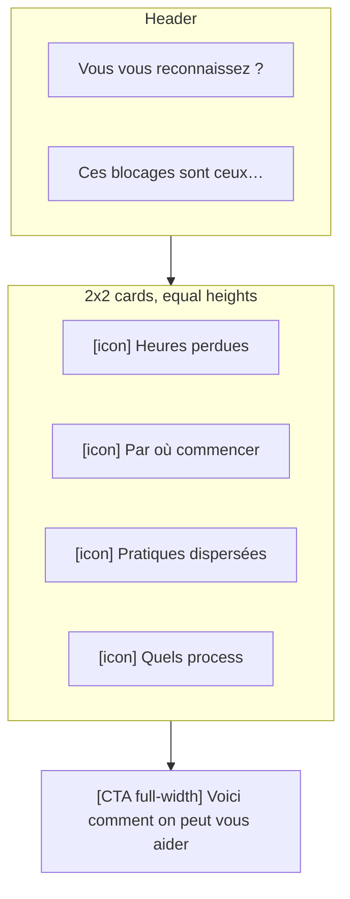

# Mobile & Tablet UX/UI Audit — Home Page

> Senior UX/UI review of the B2B landing page at `/` ([app/page.jsx](../../app/page.jsx)).
> Goal: propose a mobile and tablet redesign of every section while **locking the desktop layout (≥ lg)**.
> Deliverable: design spec only — no code is changed by this document.

---

## 0. Reading guide

### Breakpoint contract used in this doc

| Label   | Range            | Tailwind                                |
| ------- | ---------------- | --------------------------------------- |
| Mobile  | `< 768px`        | default → `md:`                         |
| Tablet  | `768 – 1023px`   | `md:` → `lg:`                           |
| Desktop | `≥ 1024px`       | `lg:` and up — **locked, do not redesign** |

Spacing tokens come from [styles/variables.css](../../styles/variables.css):
`--spacing-15 = 60px`, `--spacing-25 = 100px`, `--spacing-150 = 150px`.
So `py-150` ≈ 150px each side, `pb-[170px]` is hard-coded.

### Severity legend

- **C — Critical**: blocks comprehension, conversion, or accessibility.
- **H — High**: visibly degrades the experience for most users.
- **M — Medium**: polish / consistency.
- **L — Low**: nitpick / future improvement.

### Section template

Each section below follows the same structure:

1. Current behaviour (cited from source)
2. UX issues observed (severity-tagged)
3. Mobile redesign (proposed)
4. Tablet redesign (proposed)
5. Tailwind class direction (descriptive, not a patch)
6. Accessibility & performance notes

---

## 1. Cross-cutting recommendations

These apply to the whole home page and should be agreed before touching any section.

### 1.1 Mobile vertical rhythm

The page mixes `pt-16`, `pt-20`, `py-20`, `pt-150`, `pb-150`, `pb-[170px]`, `mb-10`, `mb-12`. On mobile this produces unpredictable gaps and an overall page that scrolls 30–40 % longer than it should.

Adopt a **3-step vertical scale** and apply it to every `<section>`:

| Token   | Mobile | Tablet | Desktop  |
| ------- | ------ | ------ | -------- |
| `sect-y`  | 64 px  | 96 px  | 150 px   |
| `block-y` | 32 px  | 48 px  | 80 px    |
| `gap-y`   | 16 px  | 20 px  | 24 px    |

Tailwind direction: `py-16 md:py-24 lg:py-[150px]` for sections, `space-y-8 md:space-y-12 lg:space-y-20` for blocks.

### 1.2 Mobile type scale

The codebase has typography tokens (`--text-heading-1` … `--text-heading-6`) but the home rarely uses them — most headings are inline `text-[40px]` overrides with no `sm:` step. Standardise:

| Role     | Mobile         | Tablet         | Desktop (locked) |
| -------- | -------------- | -------------- | ---------------- |
| Eyebrow  | 12 / 0.12em UC | 12 / 0.12em UC | 12 / 0.12em UC   |
| H1 hero  | 32 / 1.15      | 40 / 1.15      | 52 / 1.15        |
| H2 sect. | 26 / 1.2       | 32 / 1.2       | 40–52 / 1.15     |
| H3 card  | 18 / 1.3       | 20 / 1.3       | 24 / 1.3         |
| Body     | 15 / 1.55      | 16 / 1.6       | 16–17 / 1.6      |
| Caption  | 13 / 1.5       | 13 / 1.5       | 13 / 1.5         |

Body line length on mobile: target 38–55 characters; never let a paragraph exceed `max-w-[42ch]`.

### 1.3 CTA strategy

Rule for B2B mobile: **one primary CTA visible per viewport**, plus an always-available navbar CTA.

- Hero CTA: full-width on mobile, auto on tablet/desktop.
- Section-end CTAs: full-width on mobile **and** tablet (they currently use `max-md:w-full` only — extend to `max-lg:w-full`).
- Secondary "Voir le détail …" links: keep as text-with-arrow, not buttons.
- Add a **sticky bottom CTA bar** on mobile after the user scrolls past the Hero — single button "Réserver votre audit", height 56 px, drop-shadow up. Hides itself when the form / FAQ comes into view.

### 1.4 Touch targets & focus

WCAG 2.5.5 / Apple HIG: ≥ 44 × 44 px hit area for every tappable element.

- Testimonial chevron is `size-11` (44 px) — minimum, OK; pad parent so it's not flush to viewport edge.
- FAQ `<button>` is `px-5 py-3` ≈ 48 px — OK, but the icon area should expand to the full row.
- TrustBar marquee and TeamMembers cards are non-tappable on mobile — fine.
- Add `focus-visible:outline-2 outline-accent outline-offset-2` to every link/button; today most rely on default ring.

### 1.5 Motion & reduced motion

Currently used: `FadeUpAnimation` on most blocks, `react-fast-marquee` in `TrustBar`, IntersectionObserver count-up in `ResultDashboardCard`.

Add a global respect for `prefers-reduced-motion: reduce`:

- `FadeUpAnimation` → render final state immediately, skip transform.
- `Marquee` → set `play={!reduced}`; show static logos in a 5-up grid instead of scrolling.
- `ResultDashboardCard` → set `progress = 1` on mount (no count-up).

### 1.6 Performance hygiene

- Hero is above the fold but `TrustBar` and the 3-axes block are below; mark all images in `Offer` and `Testimonial` with `loading="lazy"` and `sizes` accurate to mobile (currently `sizes="(max-width: 768px) 100vw, 800px"` is right for the program-block image but missing elsewhere).
- `pb-150` on multiple sections inflates DOM height; trimming to `pb-16 md:pb-24 lg:pb-[150px]` saves ~250 px scroll on mobile per section (~1500 px total).

### 1.7 Content QA flags (not strictly UX, but found en route)

- `Faq` heading is in English ("Frequently Asked Question") on a French page ([components/shared/Faq.jsx#L11-L15](../../components/shared/Faq.jsx)).
- `FaqItem` always prefixes "Q. " ([components/shared/FaqItem.jsx#L11](../../components/shared/FaqItem.jsx)) — odd in French.
- `TrustBar` `defaultLogoPaddingClassName` and `translate-x-[-44px]` in `Clients` ([components/shared/Clients.jsx#L70](../../components/shared/Clients.jsx)) are workarounds — see § 2.2.

---

## 2. Hero (incl. TrustBar + 3-axes strip)

File: [components/home-claude/Hero.jsx](../../components/home-claude/Hero.jsx).

### 2.1 Current behaviour

- Section is `min-h-dvh` with `pt-[160px]` then a centered headline + sub + 1 CTA, then a `shrink-0` footer holding `<TrustBar />` and the orange `bg-[#ffefea]` band with the 3 axes.
- H1: `text-[40px]! md:text-[44px]! xl:text-[52px]!` — no `sm:` step, no fluid scale.
- 3 axes use `grid-cols-1 md:grid-cols-3`, with a giant numeral `text-5xl md:text-6xl lg:text-7xl` and a hairline divider that only appears at `md:`.
- Background blob is a `600×1100` blur positioned `-top-40` — paints a large pink halo above the H1 even on mobile.

### 2.2 Issues observed

- **C** — `pt-[160px]` (to clear the navbar) eats the entire above-the-fold zone on a 360 × 640 viewport: H1 starts ~ 230 px down, sub-headline + CTA push the trust bar and axes off-screen. The hero feels empty above and crammed below.
- **H** — H1 jumps `40 → 44` between mobile and tablet, then `44 → 52` between tablet and desktop. The mobile size is too large for a 360 px viewport and the tablet size is too small for a 1024 px viewport.
- **H** — One CTA is fine, but it sits inside `flex-wrap items-center justify-center gap-4`, suggesting future siblings; on mobile a single full-width button is more conversion-friendly than a centered auto-width one.
- **H** — 3-axes numerals at `text-5xl` on mobile (48 px) outweigh the axis title (~16 px). The eye reads "1 2 3" before reading any value prop.
- **M** — `bg-[#ffefea]` band starts immediately under the white trust strip on mobile, with no breathing room — the seam is visible because both strips have `py-3 / py-10`.
- **M** — `TrustBar` uses `Clients` with `translate-x-[-44px]` ([components/shared/Clients.jsx#L70](../../components/shared/Clients.jsx)) to recentre logos; on narrow viewports the negative translate clips the leftmost logo.
- **M** — `min-h-dvh` on a section that includes a footer band can produce a viewport-height block followed by a band that overflows below the fold — confusing on rotation.
- **L** — Background blob bleeds into the navbar; on mobile it's the loudest element.

### 2.3 Mobile redesign (proposed)

Layout (top → bottom):

1. Top padding aligned to navbar height + 24 px (≈ `pt-24`), not 160 px.
2. Eyebrow tag (NEW): "Cabinets d'architecture · Programme 4 semaines" — 12 px upper-case, accent colour. Anchors who the page is for.
3. H1 — 32 px, left-aligned (mobile) or centered if the brand prefers. Left-aligned scans faster and preserves a longer line per row.
4. Sub-headline — 15 px, max-w-[40ch], same alignment.
5. Primary CTA — full width, 56 px height, "Réserver votre audit" + small chevron.
6. Reassurance line under CTA — "Audit 30 min · sans engagement" (the comment in [Offer.jsx#L158](../../components/home-claude/Offer.jsx) shows this copy already exists).
7. Subtle scroll-cue chevron (optional, not animated under reduced motion).
8. **TrustBar** — convert from auto-scrolling marquee to a static 2-row, 3-up grid of greyscale logos with a "Ils nous font confiance" eyebrow. Marquee on mobile is hostile to reading and to reduced-motion users.
9. **3 axes** — stack vertically inside the orange band, but **shrink the numeral** to 28 px and put it inline with the title (`numeral · title`). Description below in 14 px. Dividers become full-width hairlines between rows, not vertical.

Hero never tries to fill `100dvh` on mobile; let the natural height win.

### 2.4 Tablet redesign (proposed)

- H1 = 40 px, sub at 16 px, both centered (matches desktop intent).
- CTA auto-width but min-width 280 px, still single.
- TrustBar: keep the marquee but reduce speed and pad the gradient masks to 80 px so the leftmost / rightmost logos are not clipped.
- 3 axes: 3-column grid as today, but reduce numeral to `text-5xl` (48 px) and tighten `gap-x-6`.

### 2.5 Tailwind class direction

- Replace `pt-[160px]` with `pt-24 md:pt-32 lg:pt-[160px]` and drop `min-h-dvh` on `< lg` (`lg:min-h-dvh`).
- H1: `text-[32px] sm:text-[36px] md:text-[40px] xl:text-[52px] leading-[1.15]` — drop the `!` overrides; cleaner CSS source.
- CTA wrapper: `flex flex-col gap-3 sm:flex-row sm:justify-center sm:flex-wrap`. CTA itself: `btn w-full sm:w-auto`.
- Axes grid: `grid-cols-1 md:grid-cols-3 divide-y md:divide-y-0 md:divide-x divide-[#e8c4b8]/60` — replace the `not-last:after` pseudo-divider trick.
- Numerals: `text-[28px] md:text-5xl lg:text-7xl` and move from `col-start-1 row-span-2` to inline on mobile via `flex items-baseline gap-3`.

### 2.6 A11y & perf

- Add `aria-label="Trust bar"` (or `<h2 className="sr-only">`) inside `TrustBar`.
- Marquee: `pauseOnHover` exists; also pass `play={!prefersReducedMotion}` and provide static fallback markup.
- Background blob: wrap in `motion-safe:` so reduced-motion users get a flat band; also `aria-hidden` (already implicit).
- Hero `<h1>` must be the only h1 on the page — verify against navbar logo.

---

## 3. PainPoints

File: [components/home-claude/PainPoints.jsx](../../components/home-claude/PainPoints.jsx).

### 3.1 Current behaviour

- Header: H2 + 1 paragraph centered in `max-w-[640px]`.
- Cards: `grid-cols-1 md:grid-cols-2 xl:grid-cols-4 gap-6`. Each card = icon chip + title + description + tag pill at bottom.
- Section CTA: `<a className="btn max-md:w-full">Voici comment on peut vous aider</a>` jumping to `#approche`.

### 3.2 Issues observed

- **H** — Tablet (768–1279 px) shows a **2 × 2 grid** that is the dominant layout for ~500 px of viewport range, yet card heights are uneven because descriptions vary in length; the bottom tag pill floats inconsistently.
- **H** — On mobile, 4 cards stacked vertically (~ 4 × 220 px = 880 px) is a long monotone scroll. No visual pacing.
- **M** — CTA is `max-md:w-full` only — at tablet (`md:`) it becomes auto-width and floats centered; given it's the only CTA in the section, full-width is better through `lg:`.
- **M** — Tag pill duplicates information already conveyed by the icon. On mobile the tag is the smallest element and adds noise rather than clarity.
- **M** — Card uses `border border-[#f1f1f1] shadow-box` — on mobile the `shadow-box` (50 px blur, 7 % opacity) is barely visible against a white background and just costs paint time.
- **L** — Section heading has a non-breaking space before `?` (good French typography) but the H2 size is the default; needs an explicit mobile size (see § 1.2).

### 3.3 Mobile redesign (proposed)

- Header: same content, H2 = 26 px, body = 15 px, tighter `mb-10`.
- Cards become a **horizontal snap carousel** (`overflow-x-auto snap-x snap-mandatory` with one card visible + a peek of the next, ~ 88 vw card width). This:
  - keeps the section short (~ 320 px tall instead of 880 px),
  - introduces rhythm,
  - signals there are 4 items via the peek,
  - keeps each card readable at full width.
- Below the carousel: small dots indicator (4 dots), counter "1 / 4" (sr-only), and prev/next is implied by swipe.
- Drop the tag pill on mobile (the icon + title pair already categorises the pain).
- CTA: full-width, just below the carousel, with a `text-paragraph-light` line "Approche en 4 semaines · présentiel" beneath.

Acceptable alternative if no carousel: keep the vertical stack but reduce visual weight — remove `shadow-box`, use a left accent border (`border-l-2 border-accent/40`), remove the tag pill, and add a divider between cards.

### 3.4 Tablet redesign (proposed)

- 2 × 2 grid as today, but enforce equal card heights by removing `min-h-full` on the inner flex and using `h-full` on the `<li>` plus `grid-auto-rows-[1fr]` on the parent.
- Tag pill kept (more horizontal real estate, less noise impact).
- CTA: full-width up to `lg`, then auto.

### 3.5 Tailwind class direction

- Carousel container: `flex gap-4 overflow-x-auto snap-x snap-mandatory scroll-px-4 px-4 -mx-4 md:hidden`.
- Card on mobile: `snap-start shrink-0 basis-[88%]`.
- Tablet grid: `hidden md:grid md:grid-cols-2 md:auto-rows-[1fr] xl:grid-cols-4 gap-6`.
- CTA: `btn max-lg:w-full` (extend the existing rule).
- H2: `text-[26px] md:text-[32px]` (apply the type scale).

### 3.6 A11y & perf

- Carousel: `role="region" aria-roledescription="carousel" aria-label="Points de blocage"`; each slide `role="group" aria-roledescription="slide" aria-label="1 sur 4"`.
- Snap carousel must be keyboard-scrollable (default with `tabindex="0"` on the container; add `focus-visible:ring-2`).
- `prefers-reduced-motion`: disable smooth scroll snap.

---

## 4. Offer

File: [components/home-claude/Offer.jsx](../../components/home-claude/Offer.jsx) + [components/home-claude/ResultDashboardCard.jsx](../../components/home-claude/ResultDashboardCard.jsx).

This is the densest section. Sub-blocks: **(a) intro statement**, **(b) sticky left column + program blocks (Phase 1, Phase 2)**, **(c) continuous-support card**, **(d) ResultDashboardCard**, **(e) "Et après ?" + 3 lifelong benefits**.

### 4.1 Current behaviour

- Section padding: `pb-150` (= 150 px) on every breakpoint; section uses a 15-column custom grid with `xl:col-span-7 / xl:col-span-8`.
- Intro paragraph: 26 px mobile → 32 px desktop, centered, `max-w-[940px]`.
- On `< xl` (so on mobile **and** tablet), the left column collapses on top, then the right column flows below — H2 + paragraph + CTA sit alone, then 3 cards stack.
- Program blocks: card-in-card design with a Phase pill, optional timeframe pill, H3, paragraph, pill row, image (`aspect-video`), and a footer text-link CTA.
- Continuous-support card: same outer style, list of 2 items with check icons.
- `ResultDashboardCard`: 2 × 2 metrics grid on `md+`, collapses to 1-col on `max-md`. Animated count-up on enter via IntersectionObserver, no reduced-motion handling ([components/home-claude/ResultDashboardCard.jsx#L48-L86](../../components/home-claude/ResultDashboardCard.jsx)).
- Lifelong benefits: 3-up grid `grid-cols-3 max-lg:grid-cols-1` — note tablet collapses to 1-col, not 2.

### 4.2 Issues observed

- **C** — Intro paragraph is **a wall of text**: 32 px on tablet, centered across 940 px, two long sentences. On mobile (26 px) it's still 6+ lines of dense type. Highest scroll-abandon risk in the section.
- **C** — On mobile, the H2 "Enclenchez votre stratégie IA en 4 semaines" appears, then a CTA, **then** the user has to scroll through Phase 1 + Phase 2 + continuous-support + dashboard before reaching another action. The CTA fires before the user has any context — and there's no second CTA after the proof.
- **H** — Tablet shows lifelong-benefits as a **single column** (`max-lg:grid-cols-1`), which is wasteful: 3 cards stacked at full container width on a 900 px viewport.
- **H** — `ResultDashboardCard` collapses to 1-column on mobile; 4 metrics × ~ 130 px each = ~520 px of dashboard alone. The "dashboard" metaphor is lost.
- **H** — Animated counter has no `prefers-reduced-motion` guard. Also, on mobile it counts as soon as 35 % of the card is visible — often before the user is ready to read it.
- **H** — Program-block "Phase" pill + timeframe pill share a row with `justify-between`; on a 320 px viewport "Phase 1" + "Semaine 1" + the gap leave the timeframe pill flush against the right card edge with no margin in some configs.
- **M** — Image inside program block uses `aspect-video` (16:9); on mobile that's ~ 160 px tall and shows the photo with a heavy `bg-blue-950/20` overlay — at this size the photo adds little value. Consider `aspect-[4/3]` on mobile or hide the image entirely.
- **M** — `pb-150` (= 150 px) at the bottom of the section on mobile is excessive; combined with the next section's top padding, it creates ~ 250 px of empty space.
- **M** — H3 inside program block uses default heading size with no mobile override.
- **M** — Pill row uses `bg-secondary/10 text-secondary` (#1187A8 teal) on a card whose accent colour is orange. Two brand colours competing inside one card is visually noisy on mobile where everything stacks.
- **L** — Two `FadeUpAnimation` wrappers nest inside `<article>` per program block; minor DOM weight.
- **L** — `mb-10 mb-12 mb-14 mb-16 mb-20` are all used in this single component; consolidate to the rhythm scale.

### 4.3 Mobile redesign (proposed)

Re-order and re-style the section around a **scroll narrative**:

1. **Intro statement** — break the single paragraph into:
    - Eyebrow "Notre approche".
    - One H3-sized lead sentence (20 px, semi-bold).
    - One body paragraph (15 px, max-w-[42ch]).
    Removes the 32-px wall.
2. **H2 + lead + CTA** of the program (current left column) — keep, but the CTA becomes full-width and is **deferred** (see step 5 — make the early CTA optional or "Voir le programme" anchor link instead of the audit CTA).
3. **Phase 1 card**, **Phase 2 card**, **Continuous-support card** stacked. Each card:
    - Phase pill on its own row, timeframe pill underneath if present (no `justify-between` wrap risk).
    - H3 18 px, paragraph 15 px.
    - Pill row keeps secondary teal (it's a metadata badge — fine when the parent card is lighter on accents).
    - Image: hidden on mobile, shown on tablet+. Saves ~ 200 px per card and removes a low-value visual.
    - Footer link: keep "Voir le détail …" with arrow, full-tap-target row.
4. **ResultDashboardCard** redesigned for mobile (see § 4.5):
    - Eyebrow + H3 header strip.
    - **2 × 2 metric grid kept on mobile** (it fits — each cell becomes ~ 150 px wide with 28 px values, perfectly readable).
    - Footer reassurance row stays.
5. **Primary CTA** "Réserver votre audit" — full-width, this is the post-proof action. Add a sub-line "Audit 30 min · sans engagement".
6. **"Et après ce programme ?"** intro + 3 lifelong-benefit cards as a **horizontal snap carousel** (same pattern as PainPoints) on mobile.

### 4.4 Tablet redesign (proposed)

- Intro: H3 lead 22 px, body 16 px, max-w-[60ch].
- Left column **not sticky** until `xl:` (already the case). Stays at top, single CTA full-width.
- Program blocks: image visible again (aspect-video acceptable at this width), pills row uses the existing flex layout but with `flex-wrap gap-2`.
- ResultDashboardCard: 2 × 2 grid (already supported via `md:grid-cols-2`).
- Lifelong benefits: **2-up grid on tablet, then 3-up on lg+** (currently jumps 1 → 3 at `lg`).

### 4.5 ResultDashboardCard — mobile-specific redesign

Today: `grid-cols-2 max-md:grid-cols-1` ([ResultDashboardCard.jsx#L104](../../components/home-claude/ResultDashboardCard.jsx)).

Change to:

- `grid-cols-2` at all sizes (keep it as a real "dashboard" — 4 KPIs in a square).
- Numeral: `text-[28px] sm:text-[32px] lg:text-[38px]`.
- Title: `text-[12.5px] leading-snug` on mobile, 13 px tablet.
- Cell padding: `p-4 sm:p-5 lg:p-6`.
- Suffix/unit baseline-aligned with numeral.
- Footer reassurance row: keep, but reduce icon to 32 px on mobile.
- Animation: respect `prefers-reduced-motion: reduce` → start at final value; also raise threshold to `0.5` so it triggers when the card is comfortably in view.

### 4.6 Tailwind class direction

- Section: `pb-16 md:pb-24 lg:pb-150` (replace flat `pb-150`).
- Intro paragraph: split into two `<p>`s; first `font-jakarta text-[20px] md:text-[22px] lg:text-[26px] font-medium`, second `text-paragraph-light text-[15px] md:text-base max-w-[60ch] mx-auto`.
- Phase header: change from `flex items-start justify-between` to `flex flex-col items-start gap-2 md:flex-row md:items-center md:justify-between`.
- Program-block image wrapper: `hidden md:block` (or render `<ImagePlaceholder>` only when `md:`).
- Lifelong benefits grid: `grid-cols-1 md:grid-cols-2 lg:grid-cols-3 gap-4`.
- ResultDashboardCard inner grid: `grid-cols-2 divide-x divide-y` (drop `max-md:grid-cols-1 max-md:divide-x-0`).
- Add `motion-reduce:transition-none` and a `prefersReducedMotion` short-circuit in [ResultDashboardCard.jsx#L48](../../components/home-claude/ResultDashboardCard.jsx).

### 4.7 A11y & perf

- The dashboard counter must expose final value to AT, not animated value: render the static value in a visually-hidden `<span>` and `aria-hidden` the animated one, or use `aria-live="off"` and announce final via `aria-label`.
- Image overlay `bg-blue-950/20` ([Offer.jsx#L118](../../components/home-claude/Offer.jsx)) reduces image contrast — verify the visible content of the photo is decorative; if so, add `role="presentation"`.
- Each program block has `<button type="button">{block.cta}</button>` with no handler ([Offer.jsx#L197-L202](../../components/home-claude/Offer.jsx)); turn into `<Link>` or wire a handler before shipping.

---

## 5. Testimonial

File: [components/shared/Testimonial.jsx](../../components/shared/Testimonial.jsx).

### 5.1 Current behaviour

- Background `bg-[#f7f2ef]`, large `pt-150 pb-150 max-md:py-20`.
- Eyebrow + H2 centered (`max-w-[550px]`).
- Swiper: `slidesPerView: 1` on mobile, `2` from `md:`. `loop` enabled when > 2 testimonials.
- Right chevron button is **hidden on mobile** (`hidden … md:flex`) and a separate centered "next" chevron is rendered **below** the slide on mobile.
- No pagination dots, no left chevron, no slide counter, no swipe affordance text.

### 5.2 Issues observed

- **H** — On mobile the only navigation is "next". A user who swipes past their employer's quote can't go back without looping all the way around (and can't even see the loop is on).
- **H** — No pagination indicator on mobile → users don't know how many testimonials exist. For a B2B trust section this is a missed opportunity ("you have 8 happy clients" is a signal).
- **M** — Slide card has `min-h-[305px]` — on a phone with a long quote, the card grows; on a short quote, it sits at 305 px with empty space. Consider `min-h-0` and let it size to content + min height for the author row.
- **M** — Author row uses `justify-between` with the avatar+name on the left and either logo or designation on the right. On a 320 px viewport, a wide logo + a long name collide — `max-w-[118px]` clips logos but names wrap awkwardly.
- **M** — Background image `service-bg.png` only renders on mobile (`md:hidden`) at full opacity 0.7 — busy backdrop behind already-decorated cards.
- **L** — `pt-150 pb-150` desktop is 300 px of vertical padding for one testimonial section.

### 5.3 Mobile redesign (proposed)

Layout (top → bottom):

1. Eyebrow + H2 (use type scale).
2. Testimonial card (full quote, min content height).
3. **Below the card**: a single row containing
    - prev chevron (44 × 44),
    - dots indicator (one per slide, current = filled accent),
    - next chevron (44 × 44).
    All within `max-w-xs` and centered, ~ 56 px tall row.
4. Optional: small "1 / 8" sr-only counter for AT; visible "Voir tous les témoignages →" text-link below.

Card content order on mobile:

- Quote (15 px / 1.6 / max 8 lines, truncate with "Lire la suite" if longer).
- Author row stacks vertically: avatar + name on row 1, company logo (or designation) on row 2 left-aligned. Removes the collision risk.

### 5.4 Tablet redesign (proposed)

- 2 slides per view (current).
- Show both prev + next chevrons (currently only "next"), positioned outside the slides on each side with the same `size-11` spec.
- Add a thin progress track under the slides (Swiper's built-in `pagination: { type: 'progressbar' }`) instead of dots — cleaner at 2-up.

### 5.5 Tailwind / Swiper direction

- Replace the dual chevron block (one for `md+`, one for `max-md`) with a unified controls row that uses Swiper's `Navigation` + `Pagination` modules. Mobile pagination type `'bullets'`, tablet+ `'progressbar'`.
- Card author row: `flex flex-col items-start gap-3 sm:flex-row sm:items-center sm:justify-between`.
- Section padding: `py-16 md:py-24 lg:py-[150px]` (replace `pt-150 pb-150 max-md:py-20`).
- Drop the mobile-only `service-bg.png` overlay or reduce to `opacity-30`.

### 5.6 A11y & perf

- Both chevrons need `aria-label` ("Témoignage précédent" / "Témoignage suivant" — second one already has it).
- Pagination dots are `<button>` elements (Swiper default) — verify they're keyboard-focusable with visible focus state.
- Loop + autoplay (if added later) must pause on `prefers-reduced-motion` and on focus-within.
- Lazy-load testimonial avatars (`loading="lazy"`) — currently no `loading` attr.

---

## 6. FAQ

Files: [components/shared/Faq.jsx](../../components/shared/Faq.jsx), [components/shared/FaQuestion.jsx](../../components/shared/FaQuestion.jsx), [components/shared/FaqItem.jsx](../../components/shared/FaqItem.jsx).

### 6.1 Current behaviour

- Section `pb-150 max-md:overflow-hidden`, with a decorative `<FaqBackground />`.
- Centered eyebrow + H2 with hard `<br />`.
- Single accordion list, only one item open at a time.
- Each item: card-in-card with a `<button>` ("Q. {question}") and an animated height container.

### 6.2 Issues observed

- **H** — H2 contains a literal `<br />` between "Asked" and "Question" — on mobile this breaks "Frequently Asked / Question" in an awkward place; the title is also in **English** while the rest of the page is French (content QA, see § 1.7).
- **H** — Accordion `<button>` has the question text but the open/close icon is just an `<svg>` in a sibling `<span>` with no `aria-label` or `aria-expanded` on the button. Screen-reader users can't tell the state.
- **M** — Card-in-card with `bg-white p-2.5` then inner `border border-dashed` reproduces the visual language of program blocks but is **overkill for a list of 8–10 questions**. On mobile every Q gets two backgrounds and a 2.5-px frame around itself, multiplied across the section.
- **M** — Body padding: `px-6 pt-6 pb-3.5` once open — the answer feels squashed against the question above it because the question button is `px-5` (one px difference) and there's no separator inside the card.
- **M** — `text-xl font-semibold` for the question is fine on desktop, but on mobile a wrapped 3-line question at 20 px takes ~ 84 px of vertical space per closed item; consider 16 px on mobile.
- **L** — `pb-150` desktop padding compounds with the next section.

### 6.3 Mobile redesign (proposed)

- Header: replace the hard `<br />` with a soft break; rewrite to French ("Questions fréquentes"). H2 26 px / 1.2.
- Drop the outer card chrome on mobile. List becomes a flat divided list:
    - Each row: question on the left, plus/minus icon on the right, full-row `<button>` (no inner card).
    - 1 px bottom border between rows.
    - Open state: answer slides down at 14.5 px / 1.6 with `pl-0 pr-6 py-4`.
- Question font: 16 px / 1.35 / `font-semibold`. Drop the "Q." prefix on mobile (the icon already signals it's a question row).
- Tap target: full row, min 56 px tall.

### 6.4 Tablet redesign (proposed)

- Keep the current card-in-card if it matches the brand language elsewhere (program blocks), but reduce question size to 18 px and split the inner padding so there's an inset border between question and answer when open.
- Two-column FAQ at `lg+` could be considered later — out of scope (desktop locked).

### 6.5 Tailwind direction

- `Faq.jsx`: rewrite the header to a single `<h2>` without `<br />`; apply the type scale; reduce `pb-150` → `pb-16 md:pb-24 lg:pb-150`.
- `FaqItem.jsx`:
    - Add `aria-expanded={isOpen}` and `aria-controls={\`faq-panel-${id}\`}` on the `<button>`; give the panel `id="faq-panel-${id}"` and `role="region"`.
    - Wrap the icon in `aria-hidden`.
    - On mobile: `max-md:bg-transparent max-md:p-0 max-md:rounded-none max-md:border-b max-md:border-borderColour` and remove the inner dashed-border `<button>` wrapper styling (`max-md:border-0 max-md:rounded-none max-md:px-0`).
    - Question text: `text-base md:text-xl`.

### 6.6 A11y & perf

- Use a single shared transition handler with `prefers-reduced-motion` fallback (set `height: auto` instantly).
- Confirm only one `<h2>` per section; FAQ items should be `<h3>` semantically (currently `<span>` inside a button — acceptable, but wrap in `<h3>` if you want them in the document outline).
- Verify focus ring is visible against the white card.

---

## 7. TeamMembers

Files: [components/shared/TeamMembers.jsx](../../components/shared/TeamMembers.jsx), [components/shared/Members.jsx](../../components/shared/Members.jsx).

### 7.1 Current behaviour

- Section: `pt-150 pb-[170px] max-md:pt-20 max-md:pb-25`.
- Header: eyebrow "Notre équipe" + H2 "Pédagogue et orientée résultats" centered, `max-w-[675px]`.
- Grid: `gap-8 max-md:grid-cols-1 grid-cols-3` (or `grid-cols-2` if exactly 2 members).
- Card: rounded image (square) + white inner card with name, summary, LinkedIn pill.

### 7.2 Issues observed

- **H** — Tablet jumps directly from `grid-cols-1` (mobile) to `grid-cols-3` (`md+`). With 3 wide cards on a 768 px viewport the image and copy area get cramped (~ 220 px wide cards minus padding).
- **H** — On mobile each card is ~ 360 px tall (image is `aspect-square`); 3 members = ~ 1100 px of pure team scroll. Consider 2-up grid on phones from 480 px (xs breakpoint).
- **M** — Card max-width `max-w-[450px]` but inside a `grid-cols-1` it expands to full container width on mobile; the inner image therefore renders at ~ 360 × 360, large for a "card". Either centre the card at `max-w-sm mx-auto` or constrain the image with `aspect-[4/3]`.
- **M** — `pb-[170px]` on a section already followed by the footer creates a huge gap before the footer on mobile.
- **M** — LinkedIn pill is the only interactive element in the card and is small (`px-[10px] py-[4px]` ≈ 28 × 24 px) — below the 44 × 44 minimum.
- **L** — `getMemberSummary` truncates at 150 chars with `...`. On mobile that's typically 5–6 lines; consider 100 chars on mobile.

### 7.3 Mobile redesign (proposed)

- Grid: `grid-cols-1 xs:grid-cols-2 md:grid-cols-2 lg:grid-cols-3` (introduce a 2-up tablet step using the existing `xs` breakpoint = 475 px).
- Card: image becomes `aspect-[4/3]` on mobile (shorter), `aspect-square` from `md:`. Saves ~ 25 % vertical space.
- LinkedIn pill: enlarge to `h-11 px-3` with `aria-label`; place it **inline with the name** at the top-right of the inner card, not at the bottom.
- Optional secondary action: tap the whole card → routes to `/teams/${id}` (already the case via two `<Link>` wrappers; consolidate to one to avoid nested-link a11y issues).
- Section padding: trim `pt-150 pb-[170px]` to `py-16 md:py-24 lg:pt-[150px] lg:pb-[170px]`.

### 7.4 Tablet redesign (proposed)

- 2-up grid (see above), `gap-6`.
- Card image `aspect-square`, copy area as today.
- Header: H2 32 px, paragraph 16 px.

### 7.5 Tailwind direction

- `Members.jsx` grid: `grid gap-6 grid-cols-1 xs:grid-cols-2 md:grid-cols-2 lg:grid-cols-3` (drop `${isTwoMembers}` branch — handle 2-member case via `lg:max-w-3xl mx-auto`).
- Card image: `aspect-[4/3] md:aspect-square`.
- LinkedIn link: `min-h-11 min-w-11 inline-flex items-center justify-center rounded-md`.
- Section: `pt-16 md:pt-24 lg:pt-[150px] pb-16 md:pb-20 lg:pb-[170px]`.

### 7.6 A11y & perf

- Two `<Link>` wrappers around the same card create nested links — flatten: a single outer `<Link>` for the card + a separate, non-nested LinkedIn link kept outside the outer Link (use a `<div>` overlay pattern, or move LinkedIn outside the card body).
- Add `loading="lazy"` to team images (none of them are above the fold).
- Provide `alt={member.name}` (currently `alt="team member image"` is generic).

---

## 8. Wireframes

### 8.1 Hero — mobile

```text
┌──────────────────────────────────┐
│  [navbar 64px]                   │
│                                  │
│  CABINETS D'ARCHITECTURE         │  ← eyebrow 12 / 0.12em
│  · Programme 4 semaines          │
│                                  │
│  Démultipliez la productivité    │  ← H1 32 / 1.15
│  de votre cabinet avec           │
│  Claude Cowork                   │
│                                  │
│  Équipez vos collaborateurs du   │  ← body 15 / 1.55
│  meilleur assistant IA…          │
│                                  │
│  ┌────────────────────────────┐  │
│  │  Réserver votre audit  →   │  │  ← CTA full-width 56px
│  └────────────────────────────┘  │
│  Audit 30 min · sans engagement  │
│                                  │
├──────────────────────────────────┤
│  ILS NOUS FONT CONFIANCE         │  ← static 2×3 logo grid
│  [logo] [logo] [logo]            │     (no marquee on mobile)
│  [logo] [logo]                   │
├══════════════════════════════════┤  ← orange band start
│  ① Formation complète des       │
│     équipes                      │
│     Pour une maîtrise de Claude  │
│  ──────────────────────────────  │
│  ② Intégration dans vos process │
│  ──────────────────────────────  │
│  ③ Stratégie & conduite du      │
│     changement                   │
└══════════════════════════════════┘
```

### 8.2 PainPoints — mobile (carousel) + tablet (grid)

Mobile:

```text
Vous vous reconnaissez ?

← swipe →
┌──────────────────┐ ┌──── (peek)
│ [icon]           │ │
│ Heures perdues   │ │
│ sur des tâches…  │ │
│                  │ │
└──────────────────┘ └────
   ●  ○  ○  ○        ← dots

┌────────────────────────────┐
│ Voici comment on peut…  →  │  ← full-width CTA
└────────────────────────────┘
```

Tablet:



### 8.3 Offer — mobile

```text
NOTRE APPROCHE                       ← eyebrow

Nous accompagnons les bureaux        ← H3 20 px lead
d'architectes ambitieux.

L'IA va transformer en profondeur    ← body 15 px
les façons de travailler — prenez
une longueur d'avance.

────────────────────────────────────

Enclenchez votre stratégie IA        ← H2 26 px
en 4 semaines

L'objectif : maîtriser Claude…       ← body
À l'issue, vous disposez d'une…

[Voir le programme ↓]                ← anchor link, not main CTA

┌────────────────────────────────┐
│ ● Phase 1                      │
│   Semaine 1                    │
│                                │
│ 1 journée de formation avec    │
│ vos équipes                    │
│                                │
│ [2 demi-journées]              │
│ ── (image hidden on mobile) ── │
│ Voir le détail →               │
└────────────────────────────────┘

┌────────────────────────────────┐
│ ● Phase 2                      │
│ 4 ateliers pratiques pour…     │
│ [4 demi-journées][1/semaine]   │
│ Voir le détail →               │
└────────────────────────────────┘

┌────────────────────────────────┐
│ ✓ Accompagnement continu       │
│   pendant 4 semaines           │
│ Au-delà de la formation…       │
│ ✓ Support prioritaire <24h     │
│ ✓ Accès aux bonnes pratiques   │
└────────────────────────────────┘

┌────────────────────────────────┐
│ RÉSULTAT                       │
│ À l'issue de ce programme      │
│ ┌─────────────┬──────────────┐ │
│ │ 100%        │ 3            │ │
│ │ Équipe      │ process      │ │  ← 2×2 KPI grid
│ │ formée      │ chronophages │ │     KEPT on mobile
│ ├─────────────┼──────────────┤ │
│ │ 90 jours    │ 1            │ │
│ │ Feuille de  │ partenaire   │ │
│ │ route       │ IA           │ │
│ └─────────────┴──────────────┘ │
│ ★ Vos spécialistes IA internes │
│   sont autonomes…              │
└────────────────────────────────┘

┌────────────────────────────────┐
│ Réserver votre audit  →        │  ← real CTA, post-proof
└────────────────────────────────┘
Audit 30 min · sans engagement

────────────────────────────────────

Et après ce programme ?

← swipe →
┌──────────────────┐ ┌── (peek)
│ ✉ Brief mensuel  │ │
│   personnalisé   │ │
└──────────────────┘ └──
   ●  ○  ○
```

### 8.4 Testimonial — mobile

```text
TÉMOIGNAGES                          ← eyebrow
Ce que nos clients disent de nous    ← H2

┌────────────────────────────────┐
│                                │
│ "Claude Cowork a transformé    │
│  notre façon de travailler…"   │
│                                │
│  [👤] Jean Dupont              │
│       [logo client]            │
└────────────────────────────────┘

  ◀   ●  ○  ○  ○  ○  ○  ○  ○   ▶   ← prev | dots | next
                                       all 44×44 hit area

Voir tous les témoignages  →
```

---

## 9. Implementation order (suggested)

If/when the team picks this up, do it in this order so each step ships value:

1. Cross-cutting tokens (§ 1.1, § 1.2) — purely additive, low risk.
2. Hero (§ 2) — biggest above-the-fold win.
3. Offer intro paragraph + ResultDashboardCard (§ 4.3, § 4.5) — biggest comprehension win.
4. PainPoints carousel (§ 3.3) — biggest scroll-length win.
5. Testimonial controls (§ 5.3) — accessibility unblock.
6. FAQ a11y + content QA (§ 6.5, § 1.7).
7. TeamMembers grid + LinkedIn target (§ 7.3).
8. Sticky bottom CTA bar (§ 1.3) — last, after everything else stabilises.

---

## 10. Out of scope (recap)

- Desktop layout (`≥ lg`).
- `PrimaryNavbar` and `Footer`.
- Visual / brand redesign (colour palette, typography choice, illustration style).
- Copy rewrite beyond the QA flags noted in § 1.7.
- Code edits — this document is a spec only.
